# Low-pass-Filtering
 Implementation of low-pass filtering with linear and non-linear phase

## Graphics:

### Question 01
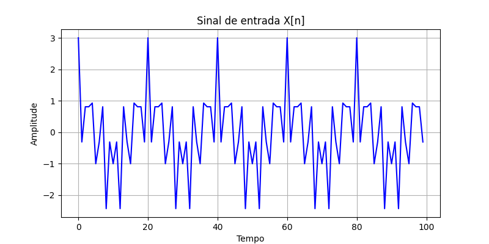

### Question 02
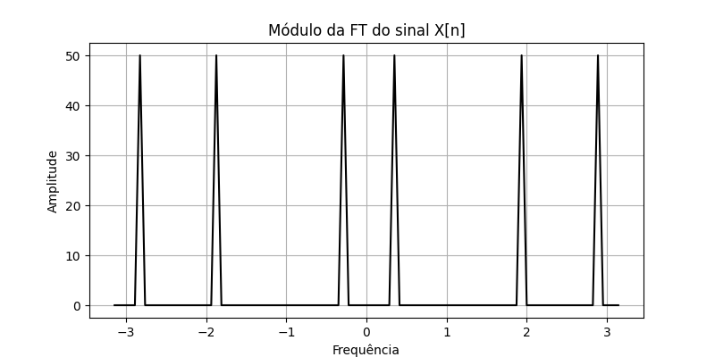

### Question 03
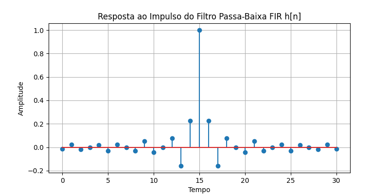

### Question 04

### Question 05
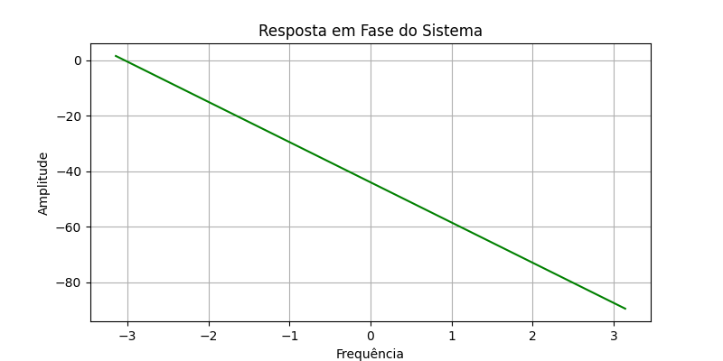

### Question 06
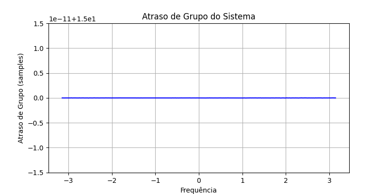

### Question 07
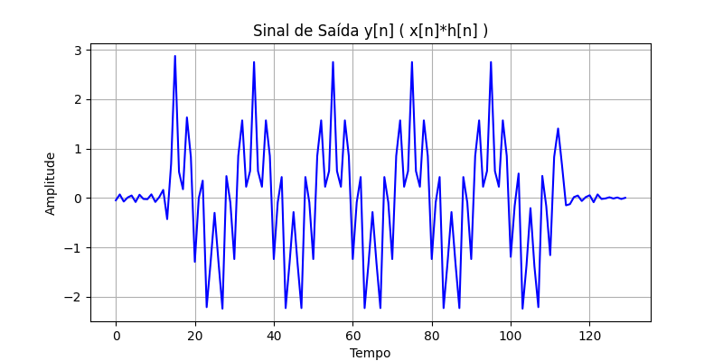

### Question 08
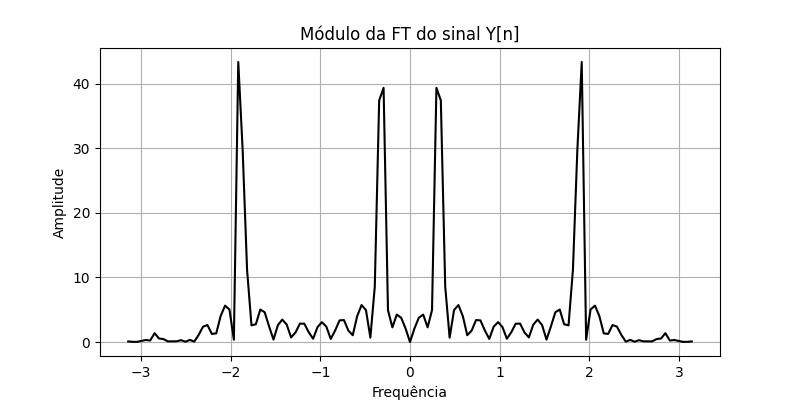

### Question 09
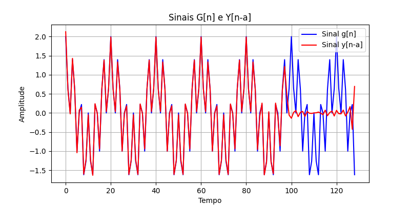

### Question 12
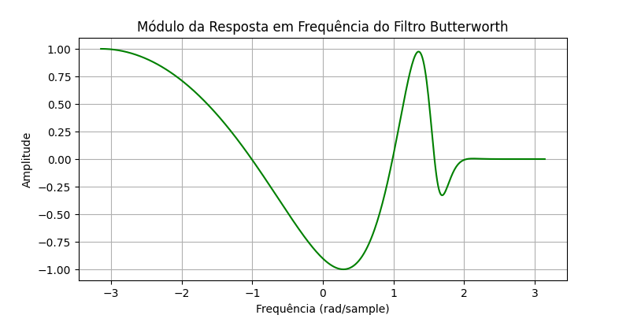

### Question 13
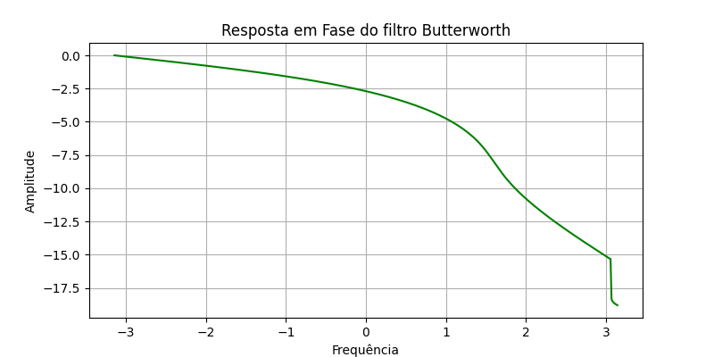

### Question 14
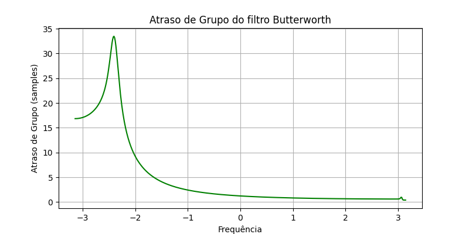

### Question 15
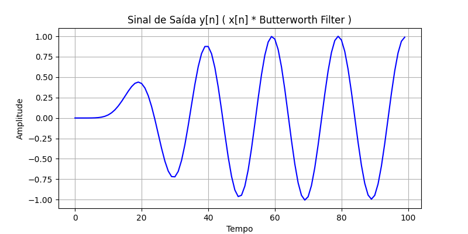

### Question 16
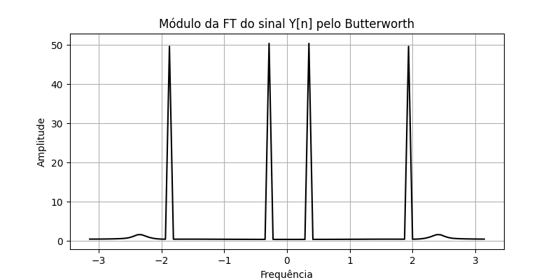

### Question 17
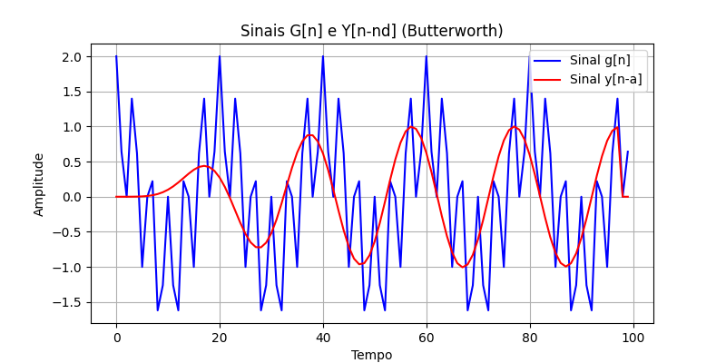
