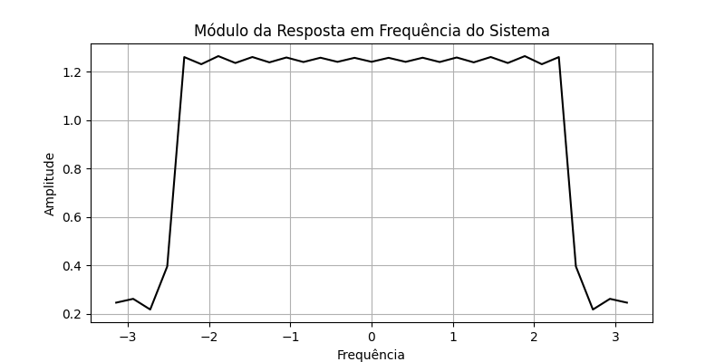
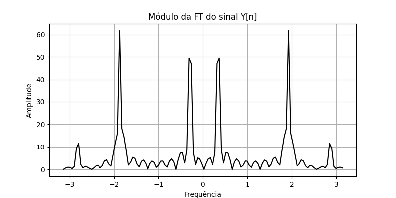
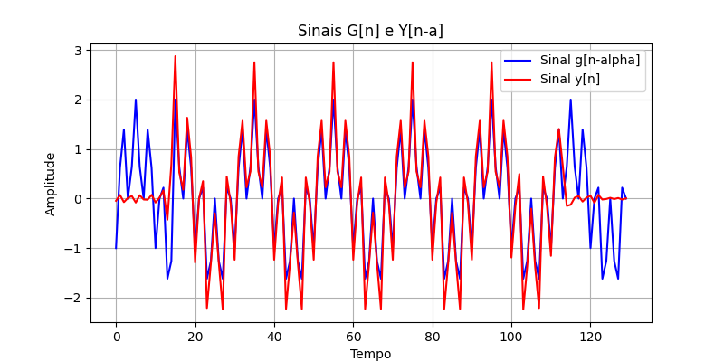
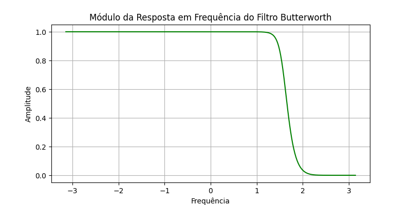
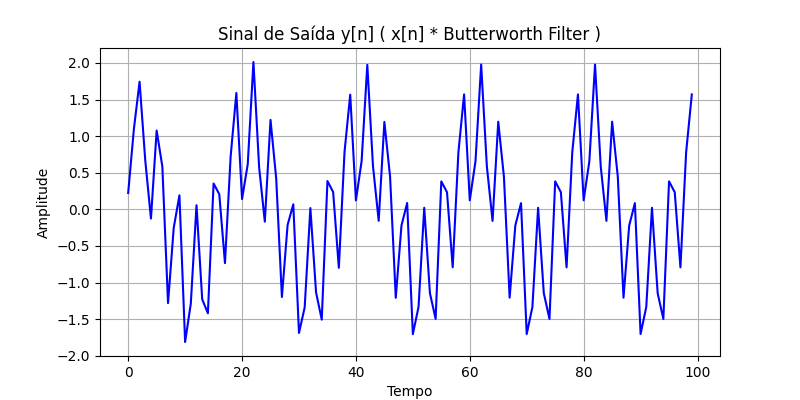
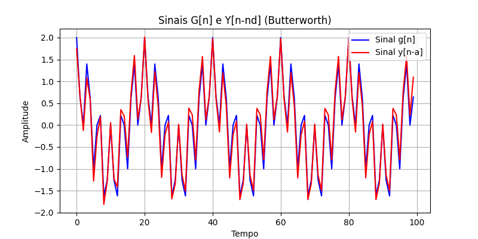

# Low-pass-Filtering
 Implementation of low-pass filtering with linear and non-linear phase

## Graphics:

### Question 01

### Question 02

### Question 03

### Question 04

### Question 05

### Question 06

### Question 07

### Question 08

### Question 09

### Question 12

### Question 13

### Question 14

### Question 15

### Question 16

### Question 17

